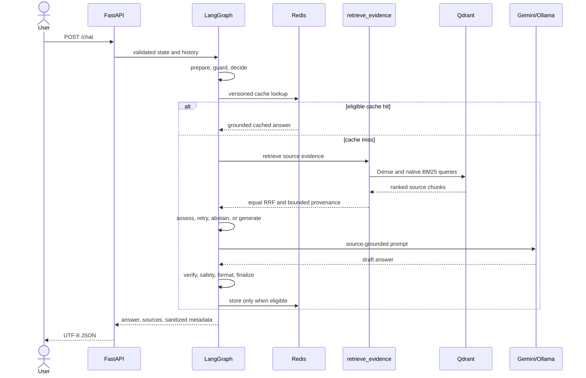

# Agent Workflow

`build_clinical_graph()` in `src/agent/graph.py` compiles the production
LangGraph `StateGraph`. The eight semantic nodes are:

```text
START -> prepare -> guard -> decide
                           | retrieve -> assess -> decide
                           | generate -> finalize -> END
                           | abstain  -> finalize -> END
                           | finalize -> END
```

`decide` is a genuine action boundary. It chooses among `retrieve`, `generate`,
`abstain`, and `finalize` from domain/cache status, provenance-complete evidence,
and the bounded attempt count. Formatting and whitespace normalization are not
treated as agent actions.

`retrieve` calls the typed `retrieve_evidence` tool. `assess` requires non-empty
text and source provenance, without a hidden semantic score. A request may make
at most two retrieval attempts. After that, insufficient evidence routes to a
deterministic, non-cacheable abstention.

Safety remains deterministic and outside optional tool choice. Generation may
use provider fallback, but the final node still applies answer verification,
severity-aware safety, source validation, presentation, cache eligibility, and
sanitized observability.

## Request Sequence



The graph schema is `ClinicalState` in `src/agent/state.py` with 66 fields.
`src/agent/nodes/workflow.py` owns all eight semantic node functions and routing
decisions; support modules do not create hidden graph actions.
