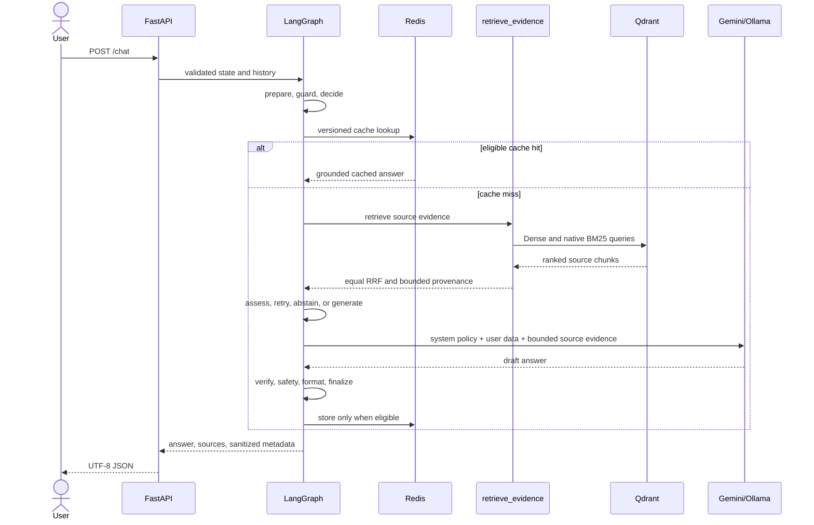

# Agent Workflow

`build_clinical_graph()` in `src/agent/graph.py` compiles the production
LangGraph `StateGraph`. The eight semantic nodes are:

```text
START -> prepare -> guard -> decide
                           | retrieve -> assess -> decide
                           | generate -> finalize -> END
                           | abstain  -> finalize -> END
                           | finalize -> END
```

`decide` is a genuine action boundary. It chooses among `retrieve`, `generate`,
`abstain`, and `finalize` from domain/cache status, provenance-complete evidence,
and the bounded attempt count. Formatting and whitespace normalization are not
treated as agent actions.

`retrieve` calls the typed `retrieve_evidence` tool. `assess` proves only that at
least one item has non-empty text and source identity. It does not prove medical
relevance, completeness, or claim entailment. A request may make at most two
retrieval attempts. A second attempt occurs only after a transient retrieval
failure or with a materially distinct original query after a rewrite returned
no evidence. Otherwise the agent abstains immediately.

Safety remains deterministic and outside optional tool choice. Generation may
use provider fallback, but the final node still applies answer verification,
severity-aware safety, source validation, presentation, cache eligibility, and
sanitized observability.

## Request Sequence



The graph schema is `ClinicalState` in `src/agent/state.py` with 66 fields.
`src/agent/nodes/workflow.py` owns all eight semantic node functions and routing
decisions; support modules do not create hidden graph actions.

Normal medical meaning follows `retrieved evidence -> LLM synthesis -> narrow
presentation/provenance processing`. Deterministic Python may replace content
only for the documented safety/failsafe paths in [Safety](SAFETY.md).
