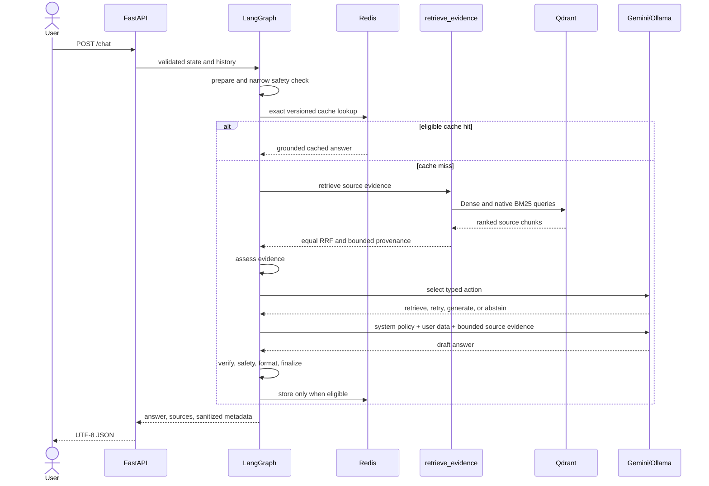

# Agent Workflow

`build_clinical_graph()` in `src/agent/graph.py` compiles the production
LangGraph `StateGraph`. The eight semantic nodes are:

```text
START -> prepare -> guard -> decide
                           | retrieve -> assess -> decide
                           | generate -> finalize -> END
                           | abstain  -> finalize -> END
                           | finalize -> END
```

`decide` is a genuine model action boundary. Except for deterministic terminal
routing after a safety override or exact-cache hit, it asks the configured LLM
for strict JSON matching `AgentDecision`. The allowed semantic actions are
`retrieve`, `retry`, `generate`, and `abstain`; the schema cannot carry medical
facts or free-form reasoning. Invalid output, impossible transitions, repeated
queries, or exhausted attempts fail closed to abstention. Formatting and
whitespace normalization are not agent actions.

`retrieve` calls the typed `retrieve_evidence` tool. `assess` proves only that at
least one item has non-empty text and source identity. It does not prove medical
relevance, completeness, or claim entailment. `retrieve` is legal only for the
first evidence acquisition at attempt zero; `retry` is legal only after one
retrieval and requires a materially different query unless the prior failure is
recoverable. A request may execute the retrieval tool at most twice. Once the
counter reaches two, both `retrieve` and `retry` fail closed to abstention;
generation remains legal only with provenance-complete evidence.

Safety remains deterministic and outside optional tool choice. Generation may
use provider fallback, but the final node still applies structural/provenance
verification, source validation, presentation, cache eligibility, and sanitized
observability.

## Request Sequence



The graph schema is `ClinicalState` in `src/agent/state.py` with 58 fields.
`src/agent/nodes/workflow.py` owns all eight semantic node functions and routing
decisions; support modules do not create hidden graph actions.

Normal medical meaning follows `retrieved evidence -> LLM synthesis -> narrow
presentation/provenance processing`. Deterministic Python may replace content
only for the documented safety/failsafe paths in [Safety](SAFETY.md).
