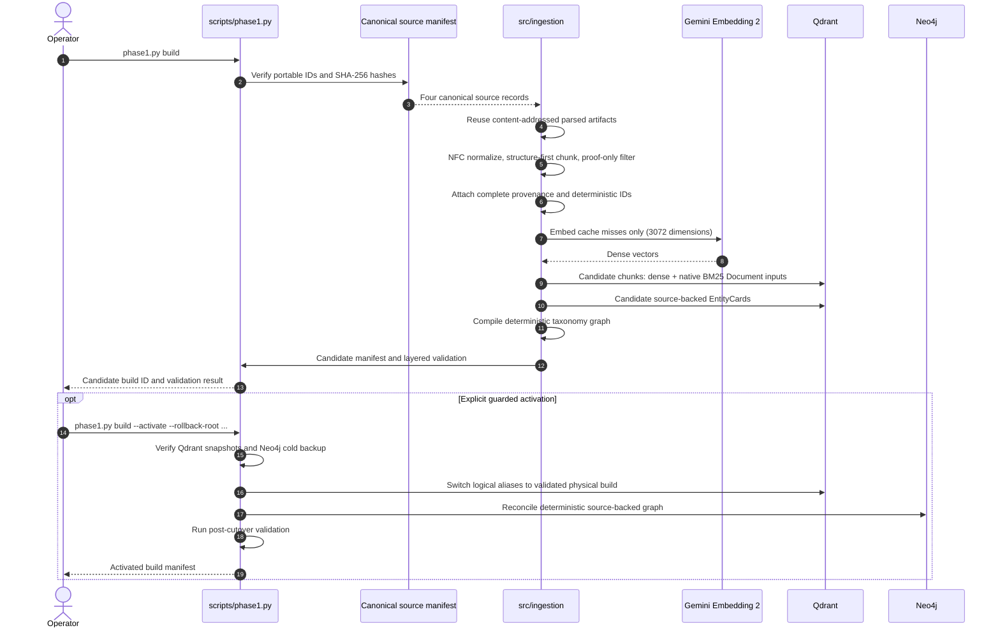

# Sơ Đồ Luồng Hoạt Động

Các sơ đồ ở đây phản ánh kiến trúc đang hoạt động sau S4A. Phase 1 chỉ có một
giao diện vận hành là `scripts/phase1.py`; semantic graph extraction bằng LLM
không thuộc nền tảng chuẩn.

## Phase 1 Frozen Knowledge Foundation

Nguồn Mermaid: [phase1-frozen-foundation.mmd](diagrams/phase1-frozen-foundation.mmd).



## Phase 2 Online Chat/RAG

Phase 2 consumes the frozen contracts read-only. Its production evidence path
uses Qdrant Dense + native BM25 + RRF. EntityCards and Neo4j are intentionally
absent from online answer generation.

```mermaid
sequenceDiagram
    autonumber
    actor User
    participant API as FastAPI
    participant Agent as LangGraph
    participant Cache as Redis
    participant Tool as retrieve_evidence
    participant Qdrant
    participant LLM as Gemini/Ollama

    User->>API: POST /chat
    API->>Agent: Validated state and history
    Agent->>Agent: Guardrail and query preparation
    Agent->>Cache: Versioned semantic cache lookup
    alt Valid cache hit
        Cache-->>Agent: Cached grounded answer
    else Cache miss
        Agent->>Tool: Retrieve source evidence
        Tool->>Qdrant: Dense + native BM25 queries
        Qdrant-->>Tool: Two ranked lists
        Tool-->>Agent: Equal-weight RRF + bounded source context
        Agent->>Agent: Assess provenance; retry, abstain, or generate
        Agent->>LLM: Source-grounded prompt
        LLM-->>Agent: Draft answer
        Agent->>Agent: Deterministic safety, formatting, and fallback
        Agent->>Cache: Store only eligible answer
    end
    Agent-->>API: Answer, source metadata, trace metadata
    API-->>User: UTF-8 JSON response
```

## Render

```powershell
& "$env:APPDATA\npm\mmdc.cmd" -i .\docs\diagrams\phase1-frozen-foundation.mmd -o .\docs\diagrams\phase1-frozen-foundation.svg -p .\docs\puppeteer-config.json
```
